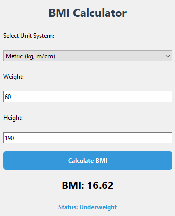
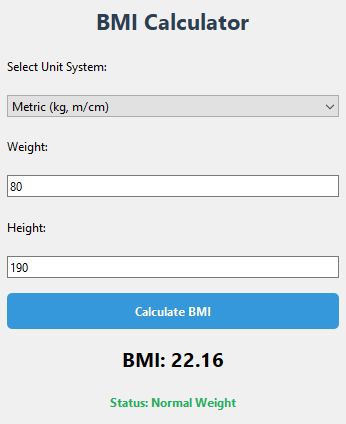
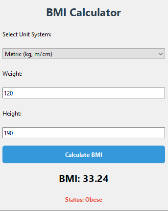

# PyQt BMI Calculator Application

A professional Body Mass Index (BMI) calculator built using **Python** and **PyQt6**. This application provides real-time health status classification based on the National Institutes of Health (NIH) guidelines.

## Features
- **Dual Unit Support**: Switch between Metric (kg/m) and Imperial (lb/in) systems.
- **Instant Calculation**: Computes BMI using the formula $BMI = \frac{\text{weight}}{\text{height}^2}$.
- **Status Indicators**: Visual feedback with color-coded health statuses.
- **Menu Bar**: Includes "File" (Clear, Exit) and "Help" (Usage instructions) options.

## NIH Guidelines Used
| BMI Range | Status | Color Code |
| :--- | :--- | :--- |
| Below 18.5 | Underweight | Blue |
| 18.5 – 24.9 | Normal Weight | Green |
| 25.0 – 29.9 | Overweight | Orange |
| 30.0 and above | Obese | Red |

## Screenshots
### Underweight Example


### Normal_weight Status Example


### Overweight Example


### Obese Status Example


## Requirements
- Python 3.x
- PyQt6

## How to run
1. Install dependencies:
   ```bash
   pip install -r requirements.txt
   python main.py

## Installation & Running
1. Clone the repository:
   ```bash
   git clone https://github.com/askarsltv17/PyQt-BMI-Calculator.git
